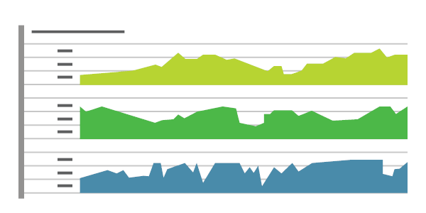

# Monitoring

**Source**: [What is Monitoring?](https://docs.microsoft.com/en-us/devops/operate/what-is-monitoring)

Monitoring provides feedback from production. Monitoring delivers information about an application's 
performance and usage patterns.

One goal of monitoring is to achieve high availability by minimizing key metrics that are measured in
terms of time:

- When performance or other issues arise, rich diagnostic data about the issues are fed back to development
  teams via automated monitoring. That's _time to detect_ (TTD).
- DevOps teams act on the information to mitigate the issues as quickly as possible so that users are no 
  longer affected. That's _time to mitigate_ (TTM).
- Resolution times are measured, and teams work to improve over time. After mitigation, teams work on how 
  to remediate problems at root cause so that they do not recur. That's _time to remediate_ (TTR).

A second goal of monitoring is to enable _validated learning_ by tracking usage. The core concept of 
validated learning is that every deployment is an opportunity to track experimental results that support
or diminish the hypotheses that led to the deployment. Tracking usage and differences between versions 
allows teams to measure the impact of change and drive business decisions. If a hypothesis is diminished, 
the team can _fail fast_ or _pivot_. If the hypothesis is supported, then the team can double down or 
_persevere_. These data-informed decisions lead to new hypotheses and prioritization of the backlog.

_Telemetry_ is the mechanism for collecting data from monitoring. Telemetry can use agents that are 
installed in the deployment environments, an SDK that relies on markers inserted into source code,
server logging, or a combination of these. Typically, telemetry will distinguish between the data 
pipeline optimized for real-time alerting and dashboards and higher-volume data needed for 
troubleshooting or usage analytics.

_Synthetic monitoring_ uses a consistent set of transactions to assess performance and availability. 
Synthetic transactions are predictable tests that have the advantage of allowing comparison from release to
release in a highly predictable manner. _Real user monitoring_ (RUM), on the other hand, means measurement 
of experience from the user's browser, mobile device or desktop, and accounts for _last mile_ conditions 
such as cellular networks, internet routing, and caching. Unlike synthetics, RUM typically does not provide
repeatable measurement over time.

Monitoring is often used to [test in production](https://docs.microsoft.com/en-us/devops/deliver/shift-right-test-production). A 
well-monitored deployment streams the data about its health and performance so that the team can spot
production incidents immediately. Combined with a
[continuous deployment release pipeline](7-CD.md), monitoring will 
detect new anomalies and allow for prompt mitigation. This allows discovery of the _unknown unknowns_ 
in application behavior that cannot be foreseen in pre-production environments.

Effective monitoring is essential to allow DevOps teams to deliver at speed, get feedback from production,
and increase customers satisfaction, acquisition and retention.

Read more about the monitoring capabilities of 
[Azure Monitor](https://azure.microsoft.com/services/monitor/).

Learn how to set up and use 
[Application Insights for monitoring](https://azure.microsoft.com/documentation/articles/app-insights-overview/).
